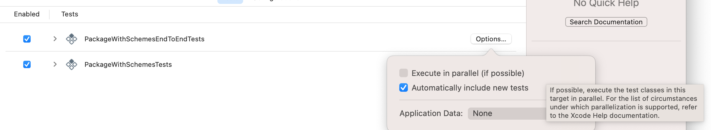
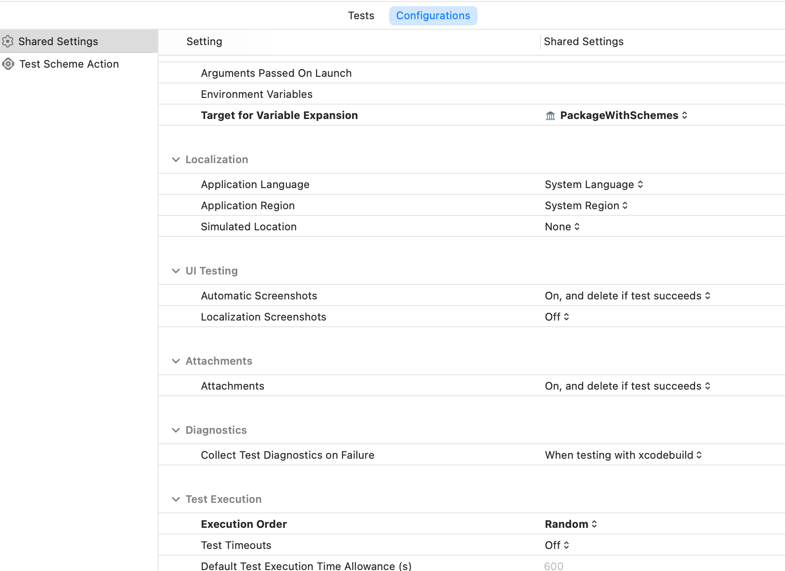

## A Swift Package with multiple schemes and test targets.

I believe it was in xcode 11 that Apple decided to remove a command that it was used for generating an xcodeproj for Swift Package. With that, you could easily follow the `xcodebuild` command line tool and its flags to build and test a swift package. Not having that around, it is a bit confusing how should one use xcodebuild for swift packages. After lots of digging around, I found out that there is actually a `xcworkspace` in the hidden `.swiftpm` directory of the swift package that you can use along with xcodebuild for testing.

#### The Test Plan part

Since xcode 14.3 (If I recall correctly), Apple decoded to move some of the configuration that we used to set in xcode, to a separate place/file, called `xctestplan`. You can create one, just like how you'd create a new swift file. But I mostly like to create them when I create a new scheme, in the scheme editor (CMD + Option + U), you can "add an exsiting test plan..." or "create a new test plan.." and assign it to your scheme. After creating them or editing them (the auto generated ones) make sure to do the following:
* unchecked the "Execute in Parallel (if possible)" in the options of the test target that you'd like to be part of your test plan.
<p>

<p/>

* In the `Configurations` tab of the test plan file, set the "Target for Variable Expantion" to the package's scheme. Plus make sure to set the "Test Execution order" to Random, by default it is set to Alphabetically.

<p>

<p/>


House keeping done!


Head over to Terminal or iTerm in my case, start running test with xcodebuild.

Note that I love `xcpretty`, if you don't have it, install it, thank me latet :)

Working with xcodebuild is pretty straight forward to be honest. it's just, you know, you need to be very careful with what you'd typing!!!

The following command prints out the associated test plan(s) to a scheme (in this case PackageWithSchemesIntegrationTests):
```
xcodebuild -showTestPlan -scheme PackageWithSchemesIntegrationTests
```

To run test with xcodebuild for a test scheme (the original one, the one that comes with the package), you run the following:

```
xcodebuild test -workspace .swiftpm/xcode/package.xcworkspace -scheme PackageWithSchemesTests -destination 'platform=iOS Simulator,name=iPhone 13 Pro Max,OS=15.5' -testPlan PackageWithSchemesTests | xcpretty
```

Now, you'd like to have an EndToEnd test, for that, you'd make a new scheme along with its own test plan associated to it, and you'd run the following:

```
xcodebuild test -workspace .swiftpm/xcode/package.xcworkspace -scheme PackageWithSchemesEndToEndTests -destination 'platform=iOS Simulator,name=iPhone 13 Pro Max,OS=15.5' -testPlan PackageWithSchemesEndToEndTests | xcpretty
```

Next, you'd like to run an intergaration test, a combination of the unit test and the EndToEnd test, you'd do the following.<br/>
The `PackageWithSchemesIntegrationTests` is a scheme that runs both the EndToEnd tests and the unit tests. In cases like this, you might think that you can add the exsiting test plans (both of them) and go with that, but the problem is, xcode sets a test plans as default, meaning you just can use one test plan at a time. For that, it's better to create a brand new test plan that it gets both the test targets as its input, with a desired configuration for itself.

```
xcodebuild test -workspace .swiftpm/xcode/package.xcworkspace -scheme PackageWithSchemesIntegrationTests -destination 'platform=iOS Simulator,name=iPhone 13 Pro Max,OS=15.5' -testPlan PackageWithSchemesIntegrationTests | xcpretty
```


That's all!

If by any chance, which is likely, you found a mistake to misinformation, I'd be really glad to have it fixed. push it or contact me on LinkedIn [here](https://www.linkedin.com/in/mohamad-rahmani/). 😊